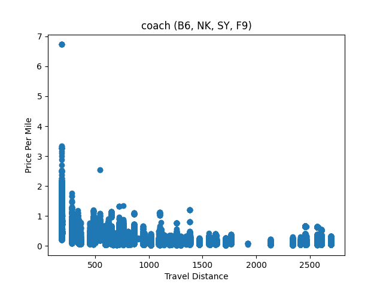
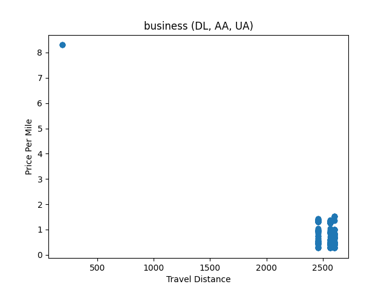

# Exploratory Data Analysis

Data source: https://www.kaggle.com/datasets/dilwong/flightprices

Airports: https://datahub.io/core/airport-codes

[Online version of this document.](https://github.com/fpeterek/strojove-uceni/tree/master/airline-fares#readme)

The dataset contains flight ticket offers scraped from Expedia. Only domestic flights
across the contiguous United States are present in this dataset. It is important to
make note of the fact that this dataset does not contain any data on sales of flight
tickets, only on publicly available ticket offerings.

The dataset contains multisegment flights. Whenever flights are analyzed by a certain
criteria, only flights where all legs meet the criteria are considered. I.e. if we're
analyzing economy class of low cost carriers (LCCs), all legs of the flight must be
operated by an LCC and the travel class for each leg must be economy.

## Do the offers include multisegment flights with airlines without a codeshare agreement?

We aggregate the data by looking at which airlines appeared alongside one another in
multisegment flights. By looking at the table entry for United Airlines, we can clearly
see UA appears in trips consisting of multiple legs where at least on leg is operated by
either American Airlines or Delta Airlines. Not only can we deduce that, as these three
major US carriers are main competitors to one another, these airlines likely do not have
a codeshare agreement, we can also check out their websites and see that our deduction
was correct.

This discovery speaks volumes about Expedia. We can clearly see that Expedia sells trips
consisting of flights with airlines without a codeshare agreement. A codeshare agreement
is important for the passenger -- if two airlines have a codeshare agreement, the passenger's
luggage will be handled by the airport personnel during a layover. Otherwise, the passenger
will have to pickup their luggage during the layover and check-in again at their next carrier's
counter. This is not only a great inconvenience, but also puts the passenger at risk of not
catching their connecting flight, if they get stuck in airport queues. Thus, we have learned
that passengers need to be wary of what trips Expedia tries to sell to them and ensure they
always have enough time to catch their connecting flights.

It is also noteworthy that the only airlines that do not appear in multi-segment flights with
other airlines are ultra low cost carriers -- Frontier Airlines (IATA `F9`), Spirit Airlines
(IATA `NK`), and Sun Country Airlines (IATA `SY`). LCCs do not offer multisegment flights
as it incurrs additional costs upon them (i.e. having to take care of passengers in case
of a delay) and they operate their flights at ridiculous times when the airport fees are
the lowest, making it difficult to find a reasonable connecting flight.

|airline|shares flights with|
|-------|-------------------|
|AA|9X, 9K, UA, B6, 4B, LF, KG|
|DL|AS, 9K, UA|
|UA|AA, 9X, 9K, HA, AS, 4B, DL, KG|
|9K|AA, UA, B6, AS, DL|
|AS|9X, 9K, UA, HA, DL|
|B6|AA, 9K, 3M|
|NK||
|9X|AA, AS, UA|
|SY||
|F9||
|KG|AA, UA|
|LF|AA|
|4B|AA, UA|
|HA|AS, UA|
|3M|B6|

## Most frequented airports

Rather surprisingly, the most visited airport in trips sold by Expedia is LAX. This statistic
does not reflect the entire air travel situation in the US. In reality, ATL is the
most frequented airport in the US,
[surpassing LAX by almost 30 milion pax/year](https://www.aerotime.aero/articles/31886-top-10-biggest-airports-in-the-world-2021).

ORD, DEN and DFW are in reality also bigger than LAX in terms of passenger traffic.

The obvious explanation would then be that Expedia is only focused on leisurely travel
and Los Angeles is a big tourist destination.

It must be noted that the data is a collection of offers scraped from Expedia, not a collection
of trips that were actually sold. Thus, we must take this data with a grain of salt, although we
can at the very least assume the airlines are not operating empty flights. A lot of effort is put
into optimizing routes served by airlines, and therefore we can assume the airports with
the most offers available are also the most desired destinations among holiday-goers.

|Airport|Airport name|Number of visits|
|-------|------------|----------------|
|LAX|Los Angeles International Airport|898365|
|ORD|Chicago O'Hare International Airport|859588|
|ATL|Hartsfield Jackson Atlanta International Airport|809379|
|CLT|Charlotte Douglas International Airport|752622|
|BOS|General Edward Lawrence Logan International Airport|716426|
|DFW|Dallas Fort Worth International Airport|707309|
|LGA|La Guardia Airport|680578|
|SFO|San Francisco International Airport|606993|
|JFK|John F Kennedy International Airport|588321|
|DEN|Denver International Airport|572937|

## Most frequent destination

If we look at the number of the most frequently offered destinations, we confirm our suspicions
from the previous section. Expedia offers a lot of trips where Los Angeles is the final
destination, meaning it is a destination favored by US citizens going on holidays.

|Airport|Airport name|Number of trips|
|-------|------------|----------------|
|LAX|Los Angeles International Airport|399995|
|LGA|La Guardia Airport|303773|
|DFW|Dallas Fort Worth International Airport|298524|
|BOS|General Edward Lawrence Logan International Airport|289517|
|ORD|Chicago O'Hare International Airport|286230|
|SFO|San Francisco International Airport|279212|
|CLT|Charlotte Douglas International Airport|270886|
|ATL|Hartsfield Jackson Atlanta International Airport|260891|
|MIA|Miami International Airport|255275|
|PHL|Philadelphia International Airport|234863|

## Most frequent trip

The two most offered routes on Expedia are a trip from Chicago to New York and vice versa.
Only the third most offered trip is a trip to LA, more specifically a trip departing from
New York.

|Route|Number of trips|
|-----|----------------|
|ORD-LGA|19753|
|LGA-ORD|19173|
|JFK-LAX|16314|
|BOS-LGA|15583|
|LGA-BOS|15487|
|JFK-BOS|14659|
|BOS-JFK|14260|
|LAX-JFK|14164|
|SFO-LAX|13853|
|ORD-BOS|13166|

## Does the date of purchase affect ticket prices

First, we want to compute the difference between the day of the flight and the day the
offer was scraped (a potential date of purchase). Then, we may wish to invert this number
so that the closer to the day of the flight we buy the ticket, the higher this
invented metric is. Airlines generally do not sell tickets more than a year in advance,
thus, we can just subtract the difference in days from 365 to get our desired metric.
We use the inverted metric to get a positive correlation if the price grows the closer
the date of purchase is to the date of the actual flight, and vice versa, making the
results more intuitive.

The first thing we notice is that there is next to no correlation if take into account
all the airlines in our dataset.

```
Correlation for travel class coach: 0.05902518247859265
Correlation for travel class business: -0.09744523681248259
```

However, the results change if only look at the three major US airlines and low cost
carriers separately.

Looking at economy class, the correlation is still slight at best.

```
Correlation for travel class coach and airlines {'AA', 'DL', 'UA'}: 0.0502795446206922
Correlation for travel class coach and airlines {'F9', 'B6', 'NK', 'SY'}: 0.12782560251368322
```

Analyzing business class finally yields interesting results. The closer we get to the date
of the flight, the higher the ticket prices are for traditional major carriers, yet, the
prices of LCCs decrease the closer the date of the flight is.

A possible explanation would be that the main clientele of traditional major carriers are
businesses. Businesses tend to buy tickets close to the date of the flight -- offline meetings
are seldom arranged a year in advance, and since businesses buy flight tickets to make money,
they do not mind investing in the flight tickets they desperately need. Another possible target
group for traditional carriers providing a luxurious or premium product would be impulsive or
busy affluent people who do not know ahead of time when they'll be able to travel.

Low cost carriers are more focused on budget conscious tourists who tend to buy tickets a long
time in advance. Therefore, they are forced to decrease their prices if the aircraft isn't fully
sold out yet to ensure the aircraft takes off completely full and the airline maximizes its
profits.

```
Correlation for travel class business and airlines {'AA', 'DL', 'UA'}: 0.35718535300323284
Correlation for travel class business and airlines {'F9', 'B6', 'NK', 'SY'}: -0.38931697477626526
```

But correlation is but a single real number and thus is incapable of providing us with
an accurate insight into the pricing of flight tickets.

We split the data into buckets by the difference between the date the offer was scraped
and the day of the flight. Which buckets were chosen can be seen in the following table.
Ranges are inclusive.

|bucket number|0|1|2|3|4|5|6|7|
|-|-|-|-|-|-|-|-|-|
|days before day of flight|0-1|2-3|4-7|8-14|15-21|22-31|31-61|62-|

First, let's take a look at economy class flights.


We can see that, for both types of carriers, the price gradually increases the closer
we get to the day of the flight, however, the increase in price is quite small. The increase
in price is more notable for LCCs, though that can be explained by the fact that LCCs tend
to price their tickets lower and thus there's more room for growth.

A rather curious thing is that the prices do not seem to differ all that much among
LCCs and major traditional carriers, at least in economy.


Unlike coach, business class looks a bit more interesting. As we can see from the boxplots,
LCCs keep gradually decreasing the cost of business class tickets as they become more and
more desperate to sell out the entire aircraft.

As was hinted at earlier, traditional major carriers price their business class tickets
reasonably if purchased ahead. The closer we get to the day of the flight, the higher the
cost becomes, to get as much money out of businesses as possible. Only the very last day
before the flight do the prices drop dramatically, to try and convince impulsive buyers
or people looking to upgrade to a higher travel class.

## Does the day of week of the flight affect ticket price

First, let's have a look at economy class.

The plot displays the relation between ticket price and day of week. Days of week start
with Monday (=0) and end with Sunday (=6).


As we can see, the prices remain mostly consistent throughout the entire week, although
there is a slight decrease in price on Tuesdays and Wednesdays.

However, things seem to change in business class.


If we look at LCCs, despite the fact that the prices are skewed differently on different
days of the week, the median price remains consistent.

However, that is not the case for traditional carriers. According to the plot, the median ticket
price seems to drop drastically on Tuesday, remains low until Thursday, and only goes back up
on Fridays. Why? A possible answer would be that businesspeople fly out on Mondays and return
on Fridays to get back home for the weekend. Weekends are then reserved for leisurely travel
of affluent people. Fewer people fly during the midweek (as they're either at work or already
on a business trip).

The drop in price in business class is more notable than it is in coach, but the reason
for the discount in ticket prices is the same for both classes.

The disparity in pricing between LCCs and traditional carriers is, yet again, caused by
a difference between clientele.

## Do tickets get more expensive as the plane gets more and more full

As the number of empty seats may possibly be anywhere between 1 and 700 (although the A380
is not used for domestic flights across the US and very few airports in the US can actually
serve the A380), we may wish to map the amounts of empty seats to buckets, with each bucket
representing a certain range of empty seats on the aircraft.

|bucket| 0|  1|  2|    3|  4|
|------|--|---|---|-----|---|
|range | 1|2-4|5-9|10-19|20+|


When examining economy class, we may notice a minor upwards trend for traditional carriers
and a slight downwards trend for LCCs. Again, this could be explained by a difference in the
way these types of carriers work. Traditional carriers tend to offer better service for
customers willing to pay a bit more. When the aircraft gets nearly sold out, they try to
create a sense of urgency and sell more expensive tickets to customers willing to pay a tiny
premium. Traditional carriers are used to flying with a non-sold out aircraft. LCCs on the
other hand need to sell out the entire aircraft. LCCs, unlike traditional carriers, usually
tend to fly with their aircraft almost completely full and sell flight tickets at a loss,
at the hopes of reclaiming the lost money by selling auxillary services such as refreshments,
seat selection, checked-in luggage, etc. Therefore they are more likely to decrease their
prices if the aircraft is not completely sold out.


We can notice a similar downwards trend when examining the pricing of business class tickets
of LCCs.

The statistics for traditional carriers, however, tell a different story. The ticket prices
start lower as the aircraft is mostly empty. As the seats get more and more sold out, the
ticket prices creep up, as the airline tries to create a sense of urgency and sell expensive
tickets to people in need. However, the prices then seem to drop drastically for the very last
available seat on the plane. Why is that? It could be because the airlines are making last minute
offers one day before the flight, but it could also be because the passenger can no longer
choose their seat, as all the other seats have already been reserved, and the passenger is
unlikely to sit alone or get a desirable seat.

## Do tickets for LCCs get sold out earlier

It must be noted that we do not know the day the ticket, if ever, was sold. However, we can
make an assumption that if certain tickets are desired, they will get sold out earlier, and
thus there will be fewer last minute deals for such flights.

We use the same grouping of airlines as we did earlier. Delta, United and American are
considered as traditional major carriers, Spirit, jetBlue, Frontier and Sun Country are our
LCCs.


By looking at the graph of economy class, we can see that the statistics for both LCCs and
traditional carriers are essentially on par.


However, things change once we start exploring the statistics of business class tickets.
Business class tickets of LCCs seem to be sold out earlier, while major carriers see
more of their tickets sold closer to the day of the flight, which would explain why there
are so many business class offers scraped closer to the date the flight takes place.

The graph of LCC business class does not differ much from economy class, either. That is
likely because LCCs and economy class are preferred by price conscious passengers such
as tourists, while traditional carrier business class is used by business or affluent people
who value flexibility over money.

## Most favored aircraft manufacturer/aircraft

To perform this analysis, we must first try to perform deduplication of flights. Flights
are hashed by their time of departure, origin and destination airports, flight operator
and, aircraft. We want to ensure no flight is counted multiple times in case there are
multiple offers for one flight present in the dataset.

Except for very special flights, such as first flight of an aircraft of a certain type
or exhibition flights, tickets aren't usually sold out by how desirable the aircraft is.
Since the dataset only contains flights across the contiguous US, we can assume the
aircraft with the most offers available are also among the most used aircraft in the US,
as the dataset only includes short-haul flights. If the dataset also included long-haul
flights, we would have to compute the flight distance of each aircraft type, as, intuitively,
aircraft flying long distance flights tend to operate fewer flights and yet cover more
distance than aircraft on short haul flights.

|manufacturer|count|
|------------|-----|
|Airbus|385261|
|Boeing|366762|
|Embraer|154672|
|CRJ|61005|
|Tecnam|2350|
|Pilatus|1345|
|Dehavilland|1291|
|Fairchild|470|
|ATR|7|

Perhaps a bit surprisingly, Airbus has managed to take the lead as the preferred manufacturer.
The US is a home to Boeing, and, in the past, the Boeing 737 used to be the most widespread
passenger aircraft in the world. However, very recently, partly also due to the MAX-8 fiasco,
the Airbus A320 has managed to overtake the B737 in the total number of orders.

Even by adding the three narrow-bodies built by Boeing and present in the list, we end up
10000 flights short of the Airbus A320, and that does not include the A220, which is also
becoming increasingly more popular (and that Boeing has no answer for).

However, Boeing wide-bodies (B767, B777, B787 Dreamliner) are a lot more popular than Airbus
wide-bodies (Airbus A350, Airbus A330).

Regional turbofan aircraft (CRJ's, E175) are also rather common, and there are even a couple
turboprops in the list.

|model|count|
|------------|-----|
|Airbus A320|367909|
|Boeing 737|299612|
|Embraer 175|121960|
|CRJ 900|51330|
|Boeing 757|32118|
|Embraer 190|22346|
|Boeing 717|20292|
|Airbus A220|16529|
|Boeing 777|10794|
|Embraer 145|10366|
|CRJ 700|9675|
|Boeing 787|2717|
|Tecnam P2012|2350|
|Pilatus PC-12|1345|
|Dehavilland DHC-8|1291|
|Boeing 767|1229|
|Fairchild Dornier 238|470|
|Airbus A330|457|
|Airbus A350|366|
|ATR 72|4|
|ATR 42|3|

## Does price per mile vary based on total distance

We are only analyzing direct flights to filter out the effect of connections
on ticket pricing.







Price per mile of business class tickets does not tell us anything due to a lack of data.

Price per mile for economy tickets seems to drop exponentially as the total distance
increases. This result is to be expected -- on very short flights, fixed airport fees and
taxes make up a very big portion of the fare. However, as distance increases and fuel,
aircraft time, and wage costs become more and more pronounced, fixed fees start to make up
a much less significant portion of the fare and price per mile decreases.

We can also see that the price per mile of LCCs is notably lower than the price per mile
of traditional carriers.

## Is business class priced differently on wide-bodies

Economy tends to be rather similar among both narrowbody and widebody aircraft. 
(Actually narrowbodies may not have an IFE system fitted and the seats might use
a different material -- leather is used for short-haul flights because it's easier
to clean after the flight, but fabric is used for long-haul flights, because it
allows the human body to breath better and thus the passengers sweat less and feel
better throughout the long flight, but the difference is still rather minor).

Business class can differ because wide-bodies are used for long haul flights
and thus it's more desirable for airlines to provide a better product.
The question is, does the price of business class tickets correlate with
the amount of aisles?

Yet again, we want to split the tickets into multiple buckets, this time by travel
distance, to ensure we are comparing fares of similar routes. Again, we can only
perform such a simple analysis because we're only analyzing domestic air travel
across the contiguous US. International air travel would be a lot more complicated
to analyze due to differences in air traffic fees, landing fees, taxes, and even
closed airspaces.

|bucket|4|5|
|------|-|-|
|distance|2000-2500|2500-3000|


The result is rather surprising. Even though we may expect a better product on wide-body
aircraft, the tickets seem to be priced lower. One possible explanation is that there are way
too many business class seats to fill on a domestic flight, and the airlines have to
price the tickets lower to make sure they sell a sufficient amount of business class tickets.

Another possible explanation is that widebodies are used on more desired routes and airlines
will likely face higher competition on such routes, therefore they have to lower their prices
to stay competetive, whereas on more niche routes, where there is less competition, and where
narrowbody aircraft would be used, people are happy to find any flight and are more willing
to shell out a higher sum of money.

